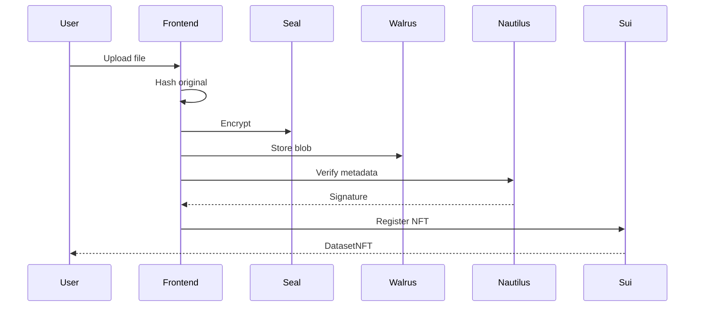

# SealTrust Frontend

Next.js web application for dataset verification and encrypted storage.

Built on Sui | Walrus | Seal | Nautilus TEE

---

## The Problem

Users need a simple interface to:
- Upload datasets with cryptographic verification
- Control who can access their data
- Download and verify dataset integrity

## The Solution

A web app that handles the full pipeline: hash, encrypt, store, verify, and record.



---

## Quick Start

```bash
# Install
pnpm install

# Configure
cp .env.example .env.local
# Edit .env.local with contract addresses

# Run
pnpm dev
```

Open http://localhost:3000

---

## Configuration

Create `.env.local`:

```env
NEXT_PUBLIC_SUI_NETWORK=testnet

# Deployed contracts
NEXT_PUBLIC_VERIFICATION_PACKAGE=0xcdc25c90e328f2905c97c01e90424395dd7b10e67769fc8f4ae62b87f1e63e4e
NEXT_PUBLIC_ENCLAVE_CONFIG_ID=0x55d6a15a5e8822b39f76dc53031d83beddc1e5b0e3ef804b82e8d4bfe4fbdc32
NEXT_PUBLIC_SEAL_PACKAGE_ID=0x705937d7b0ffc7c37aa23a445ed52ae521a47adcdffa27fe965e0b73464a9925

# Services
NEXT_PUBLIC_NAUTILUS_URL=http://13.217.44.235:3000
```

---

## How We Use the Tech Stack

<details>
<summary>Seal Encryption</summary>

```typescript
import { sealService } from '@/lib/seal-service';

// Hash BEFORE encryption (for integrity verification)
const hash = await sealService.hashFile(file);

// Encrypt with access control
const { encryptedData, policyId } = await sealService.encryptDataset(
  file,
  SEAL_PACKAGE_ID
);
```

</details>

<details>
<summary>Walrus Storage</summary>

```typescript
import { walrusService } from '@/lib/walrus-service';

// Upload encrypted blob
const { blobId } = await walrusService.uploadToWalrus(encryptedFile, 5);

// Download for decryption
const blob = await walrusService.downloadFromWalrus(blobId);
```

</details>

<details>
<summary>Nautilus Verification</summary>

```typescript
const response = await fetch(`${NAUTILUS_URL}/verify_metadata`, {
  method: 'POST',
  headers: { 'Content-Type': 'application/json' },
  body: JSON.stringify({ metadata }),
});

const { signature } = await response.json();
```

</details>

<details>
<summary>Sui Registration</summary>

```typescript
const tx = new Transaction();

tx.moveCall({
  target: `${PACKAGE}::sealtrust::register_dataset_dev`,
  typeArguments: [`${PACKAGE}::sealtrust::SEALTRUST`],
  arguments: [
    tx.pure.vector('u8', nameBytes),
    tx.pure.vector('u8', formatBytes),
    // ... other fields
    tx.object(ENCLAVE_CONFIG_ID),
  ],
});

await signAndExecuteTransaction({ transaction: tx });
```

</details>

---

## Pages

| Route | Description |
|-------|-------------|
| `/` | Landing page |
| `/register` | Upload and register dataset |
| `/explore` | Browse registered datasets |
| `/verify` | Verify dataset by hash |
| `/dataset/[id]` | Dataset details and download |

---

## File Structure

```
src/
├── app/
│   ├── register/       # Upload flow
│   ├── explore/        # Dataset browser
│   ├── verify/         # Hash verification
│   └── dataset/[id]/   # Details page
├── components/
│   ├── dataset/        # Dataset UI components
│   └── wallet/         # Wallet connection
├── lib/
│   ├── seal-service.ts    # Seal encryption
│   ├── walrus-service.ts  # Walrus storage
│   ├── constants.ts       # Configuration
│   └── types.ts           # TypeScript types
└── hooks/
    └── useNautilus.ts     # TEE integration
```

---

## Key Implementation Details

### Hash Before Encrypt

```typescript
// CORRECT: Hash original, then encrypt
const hash = await hashFile(file);
const encrypted = await encrypt(file);

// WRONG: Cannot verify integrity after decryption
const encrypted = await encrypt(file);
const hash = await hashFile(encrypted);
```

### Session Keys

Session keys minimize wallet popups. Created once, valid for 10 minutes:

```typescript
const sessionKey = await SessionKey.create({
  address: userAddress,
  packageId: SEAL_PACKAGE_ID,
  ttlMin: 10,
  suiClient,
});
```

### BCS Serialization

TypeScript types MUST match Rust and Move exactly:

```typescript
// Must match nautilus-app/src/lib.rs
interface DatasetVerification {
  dataset_id: number[];
  name: number[];
  description: number[];
  format: number[];
  size: number;
  original_hash: number[];
  walrus_blob_id: number[];
  seal_policy_id: number[];
  timestamp: number;
  uploader: number[];
}
```

---

## Development

```bash
# Dev server
pnpm dev

# Build
pnpm build

# Lint
pnpm lint

# Type check
pnpm type-check
```

---

## Deployment

### Vercel (Recommended)

```bash
vercel
```

Set environment variables in Vercel dashboard.

### Docker

```bash
docker build -t sealtrust-frontend .
docker run -p 3000:3000 sealtrust-frontend
```

---

## Troubleshooting

| Issue | Solution |
|-------|----------|
| Nautilus connection failed | Check `NEXT_PUBLIC_NAUTILUS_URL` and ensure enclave is running |
| Wallet popup every time | Session key expired (normal after 10 min) |
| Hash mismatch on download | File was uploaded before integrity fix - re-upload |
| CSP blocking key servers | Already configured in `next.config.ts` |

---

## Reference

- [Sui dApp Kit](https://sdk.mystenlabs.com/dapp-kit)
- [Seal SDK](https://github.com/MystenLabs/seal)
- [Walrus](https://docs.walrus.site/)
